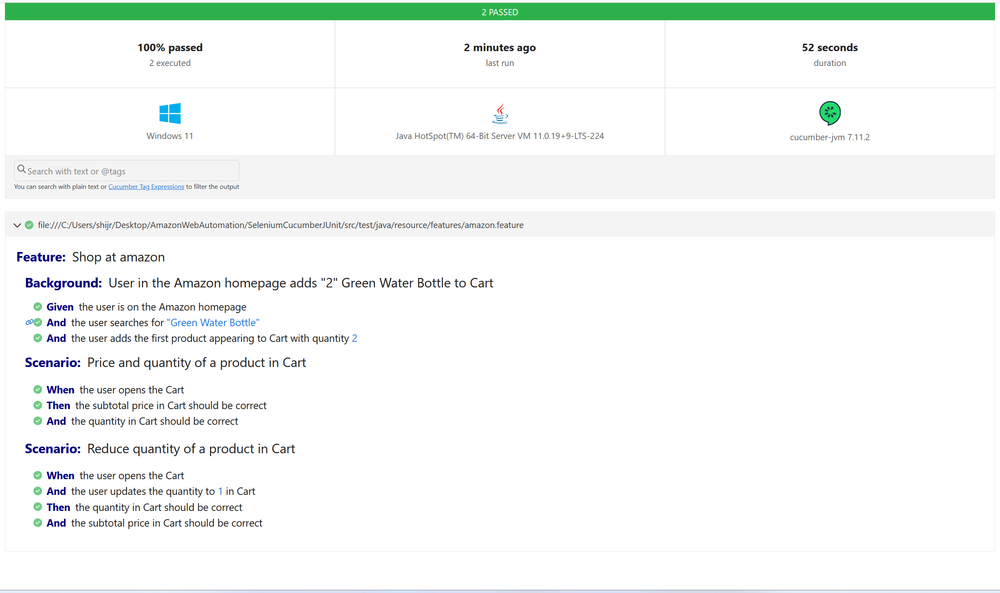

# Shop At Amazon 

This project is a Java-based test automation framework using **Selenium, Cucumber, and JUnit** for automating tests on Amazon's website. It covers a simple test scenario to demonstrate how to use these tools in a test automation project.

## Report 

## Running the Scenarios

To execute the automated scenarios, use the following command in your terminal:

```bash
mvn clean test
```


## Make sure you have following:

Java (version > 11)
Apache Maven (version > 3.0.0)
Chrome browser installed (the WebDriver manager will download the appropriate driver for your Chrome version)
Please note that this configuration has been tested on Windows. You can also modify the browser used in the Driver class if needed.

Enjoy using this test automation framework for your projects!

